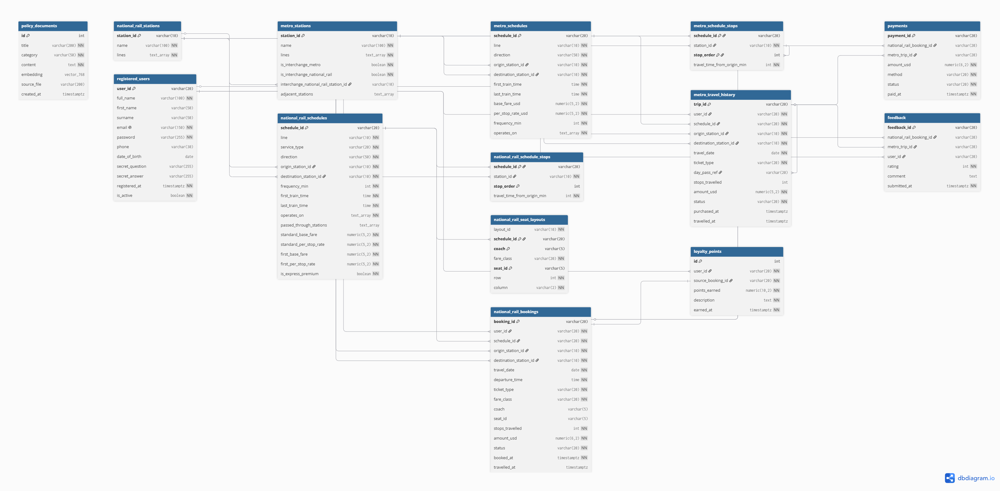
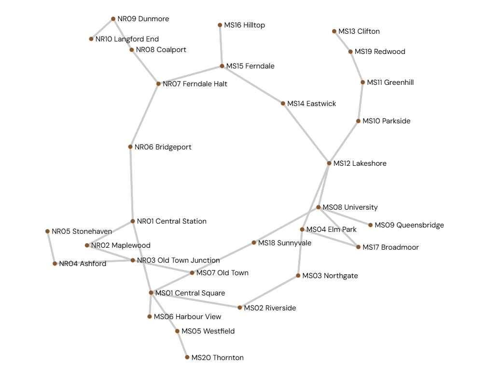

# TransitFlow Database Design Document

## Section 1 — Entity-Relationship Diagram

The relational database is designed around TransitFlow's booking, payment, feedback, user, schedule, station, and policy-document workflows. The ER diagram below shows the main PostgreSQL entities, primary keys, foreign keys, representative attributes, and relationship cardinalities.



The main relational entities are:

| Entity | Purpose | Key Fields |
| --- | --- | --- |
| `registered_users` | Stores passenger accounts and authentication-related fields | `user_id` PK, `email`, `password`, `is_active` |
| `metro_stations` | Stores Metro station reference data | `station_id` PK, `name`, `lines`, `adjacent_stations` |
| `national_rail_stations` | Stores National Rail station reference data | `station_id` PK, `name`, `lines` |
| `metro_schedules` | Stores Metro timetable records | `schedule_id` PK, `origin_station_id` FK, `destination_station_id` FK |
| `national_rail_schedules` | Stores National Rail timetable and fare-rate records | `schedule_id` PK, `origin_station_id` FK, `destination_station_id` FK |
| `metro_schedule_stops` | Junction table that stores ordered Metro stops per schedule | `(schedule_id, stop_order)` PK, `station_id` FK |
| `national_rail_schedule_stops` | Junction table that stores ordered National Rail stops per schedule | `(schedule_id, stop_order)` PK, `station_id` FK |
| `national_rail_seat_layouts` | Stores seat inventory for each National Rail schedule | `(schedule_id, coach, seat_id)` PK |
| `national_rail_bookings` | Stores National Rail reservations | `booking_id` PK, `user_id` FK, `schedule_id` FK |
| `metro_travel_history` | Stores Metro travel records | `trip_id` PK, `user_id` FK |
| `payments` | Stores payment and refund records for rail bookings or metro trips | `payment_id` PK, `national_rail_booking_id` FK, `metro_trip_id` FK |
| `feedback` | Stores user feedback linked to either a rail booking or a metro trip | `feedback_id` PK, `national_rail_booking_id` FK, `metro_trip_id` FK |
| `loyalty_points` | Task 6 extension ledger for earned loyalty points | `id` PK, `user_id` FK, `source_booking_id` FK |
| `policy_documents` | pgvector-backed policy chunks for RAG search | `id` PK, `embedding vector(768)` |

Most relationships are one-to-many. For example, one registered user can have many National Rail bookings, many Metro trips, many payments, and many feedback records. Schedule-to-stop relationships are modeled through junction tables because each schedule contains many ordered stops, and each station can appear in many schedules. `payments` and `feedback` use separate nullable foreign keys for National Rail bookings and Metro trips, with a check constraint that requires exactly one target per row.

## Section 2 — Normalisation Justification

### 2.1 Second Normal Form: Ordered Stops as Junction Tables

The schedule stop design was normalized by moving ordered stop data out of array-style columns and into dedicated junction tables: `metro_schedule_stops` and `national_rail_schedule_stops`.

If a schedule stored stops as a single array field, such as `stops_in_order = ['MS01', 'MS02', 'MS03']`, the design would violate first normal form because one cell would contain multiple values. It would also make stop-level attributes, such as travel time from the origin, difficult to constrain or query.

The normalized Metro stop relation uses the composite candidate key:

```text
{schedule_id, stop_order}
```

The main functional dependency is:

```text
{schedule_id, stop_order} -> {station_id, travel_time_from_origin_min}
```

This means the station at a specific position in a specific schedule is determined only by the full composite key. `station_id` and `travel_time_from_origin_min` do not depend only on `schedule_id`, and they do not depend only on `stop_order`. Because no non-key attribute depends on only part of the composite key, the design eliminates partial functional dependency and satisfies second normal form.

The same reasoning applies to `national_rail_schedule_stops`.

### 2.2 Third Normal Form: Station Master Data

Station names and line information are stored in station master tables instead of being copied into booking history rows. For National Rail bookings, the booking table stores station IDs as foreign keys:

```text
national_rail_bookings.origin_station_id -> national_rail_stations.station_id
national_rail_bookings.destination_station_id -> national_rail_stations.station_id
```

If `national_rail_bookings` stored station names directly, the candidate key of the booking table would be `{booking_id}`, and the following dependency chain would exist:

```text
booking_id -> origin_station_id
origin_station_id -> station_name
```

That creates a transitive dependency:

```text
booking_id -> origin_station_id -> station_name
```

This violates third normal form because `station_name` is a non-key fact about the station, not a fact about the booking itself. It also creates update anomalies: changing a station name would require updating every historical booking row. By moving station names into `national_rail_stations`, the dependency is kept in the correct table:

```text
station_id -> name
```

The booking table now stores only the foreign keys needed to identify the route used by the booking.

### 2.3 Deliberate De-normalisation Trade-off

The system keeps most operational data normalized, but `national_rail_schedules` deliberately stores fare-rate fields directly:

```text
standard_base_fare
standard_per_stop_rate
first_base_fare
first_per_stop_rate
```

A fully normalized design could move these values into a separate fare-rate lookup table by service type and fare class. However, schedule search and fare estimation are hot read paths in this transit assistant. When a user asks for available trains, the system must retrieve candidate schedules and estimate fare values quickly.

Keeping these fare-rate fields on `national_rail_schedules` allows the availability query to compute estimated fares without an extra join. This is a deliberate read-performance trade-off. Fare rules change much less frequently than booking and search operations, so the risk of update anomalies is lower than the benefit of faster reads on the most common user workflow.

### 2.4 Password Hashing and Salt Management

The `registered_users.password` field does not store plain-text passwords. The application hashes passwords with `bcrypt` before inserting or updating user records. Seeded mock-user passwords are also converted to bcrypt hashes before being inserted.

`bcrypt` was selected instead of MD5, SHA-1, or SHA-256 because those algorithms are fast hashes. Fast hashes are useful for file checksums, but they are weak for password storage because an attacker can test a large number of guesses per second using commodity GPUs.

`bcrypt` is designed for password security. It includes key stretching through a configurable cost factor, so each password verification intentionally requires repeated computation. As hardware becomes faster, the cost factor can be increased to keep brute-force attacks expensive.

`bcrypt` also manages salt automatically. Each password hash includes a randomly generated salt, and the salt is embedded in the stored bcrypt string. This prevents rainbow-table attacks. For example, if users `RU01` and `RU02` both use the same password, the stored hashes will still be different because each hash uses a different random salt. An attacker cannot use one precomputed hash lookup to identify both passwords.

## Section 3 — Graph Database Design Rationale

The graph database models the physical transit network. Stations are nodes, route links are relationships, and operational details such as line name and travel time are relationship properties.



### 3.1 Nodes, Relationships, and Properties

| Node Label | Meaning | Count | Key Properties |
| --- | --- | ---: | --- |
| `MetroStation` | Metro stops such as Central Square and Riverside | 20 | `station_id`, `name`, `lines` |
| `NationalRailStation` | National Rail stations such as Central Station and Stonehaven | 10 | `station_id`, `rail_station_id`, `name`, `lines` |

Stations are modeled as nodes because they are the stable locations that route-finding starts from, ends at, and passes through. A station can have many neighboring stations, so graph adjacency is a natural representation.

| Relationship Type | Meaning | Direction | Key Properties |
| --- | --- | --- | --- |
| `METRO_LINK` | Connection between Metro stations | Bidirectional pairs | `line`, `travel_time_min` |
| `RAIL_LINK` | Connection between National Rail stations | Bidirectional pairs | `line`, `travel_time_min` |
| `INTERCHANGE_TO` | Transfer path between a Metro station and a National Rail station | Bidirectional pairs | Transfer time is handled in query logic as 5 minutes |

Relationships are used because the important routing facts belong to the connection between two stations, not only to the station itself. For example, `travel_time_min` describes a link from one station to another.

### 3.2 Why Graph Is Better Than SQL for Routing

Routing queries are path queries. In SQL, a shortest-path query requires a recursive CTE that repeatedly joins a station-link table to itself while manually tracking visited nodes to avoid cycles:

```sql
WITH RECURSIVE path AS (
    SELECT station_id, ARRAY[station_id] AS visited, 0 AS total_time
    FROM metro_stations
    WHERE station_id = 'MS01'

    UNION ALL

    SELECT adj.to_station_id,
           p.visited || adj.to_station_id,
           p.total_time + adj.travel_time_min
    FROM path p
    JOIN metro_links adj ON adj.from_station_id = p.station_id
    WHERE NOT adj.to_station_id = ANY(p.visited)
)
SELECT *
FROM path
WHERE station_id = 'MS14'
ORDER BY total_time
LIMIT 1;
```

This becomes harder when the query crosses from Metro to National Rail because the SQL version must combine multiple link tables and manually preserve path state.

In Neo4j, the same problem is naturally expressed as a graph traversal:

```cypher
MATCH (start), (end)
WHERE (start.station_id = 'MS01' OR start.rail_station_id = 'MS01')
  AND (end.station_id = 'MS14' OR end.rail_station_id = 'MS14')
MATCH p = shortestPath((start)-[:METRO_LINK|RAIL_LINK|INTERCHANGE_TO*..12]-(end))
WITH p,
     reduce(total = 0, r IN relationships(p) |
         total + CASE type(r)
             WHEN 'INTERCHANGE_TO' THEN 5
             ELSE coalesce(r.travel_time_min, 3)
         END
     ) AS total_time_min
RETURN p, total_time_min
ORDER BY total_time_min
LIMIT 1;
```

The graph model is better for this workload because Neo4j stores adjacency directly. Traversing from a node to its neighbors is the database's native access pattern, while SQL must repeatedly join rows and maintain path arrays. For shortest-path and delay-ripple questions, the graph model maps directly to BFS-style traversal and weighted route scoring.

### 3.3 Query Types Enabled by the Graph Model

`query_shortest_route(origin_id, destination_id, optimise_by)` finds a route between two station IDs. It uses Neo4j path matching and sums `travel_time_min` over the relationships. `INTERCHANGE_TO` edges add a fixed transfer cost.

`query_interchange_path(origin_id, destination_id)` finds a cross-network route and ensures that at least one `INTERCHANGE_TO` relationship appears in the path. This is much simpler than the relational equivalent, where Metro and National Rail links would need to be combined before recursive traversal.

The graph also supports `query_delay_ripple(delayed_station_id, hops)`, which finds nearby affected stations within a limited number of hops. This is a natural graph-neighborhood query because the result depends on distance from one disrupted node rather than on a fixed table relationship.

### 3.4 Node Identity

Each `MetroStation` is uniquely identified by `station_id`, such as `MS01` through `MS20`. Each `NationalRailStation` stores both `rail_station_id` and `station_id`, such as `NR01` through `NR10`, for compatibility with the existing query code.

The graph seed script creates uniqueness constraints:

```cypher
CREATE CONSTRAINT IF NOT EXISTS FOR (m:MetroStation)
    REQUIRE m.station_id IS UNIQUE;

CREATE CONSTRAINT IF NOT EXISTS FOR (r:NationalRailStation)
    REQUIRE r.rail_station_id IS UNIQUE;

CREATE CONSTRAINT IF NOT EXISTS FOR (r:NationalRailStation)
    REQUIRE r.station_id IS UNIQUE;
```

These identifiers were chosen because they already exist in the mock data and are human-readable. They also make seeding idempotent: `MERGE` can match existing stations instead of creating duplicates every time the seed script is rerun.

## Section 4 — Vector / RAG Design

### 4.1 Embedded Data and Cosine Similarity

The vector database stores embedded policy-document chunks in `policy_documents`. These chunks come from customer-service policies such as refund rules, booking rules, ticket types, and travel policies.

The system uses cosine similarity through `vector_cosine_ops`. Cosine similarity is appropriate for semantic text search because it measures directional similarity in embedding space instead of absolute vector length. User questions are often short, while policy chunks are longer. Euclidean distance can be biased by magnitude differences, but cosine similarity focuses on whether the query and document point in a similar semantic direction.

### 4.2 RAG Pipeline

The RAG workflow follows four stages:

1. Query embedding: the user's natural-language question is converted into an embedding vector using the configured embedding model.
2. Similarity search: PostgreSQL with pgvector compares the query vector against `policy_documents.embedding` and retrieves the top matching chunks.
3. Retrieved documents and prompt construction: the selected policy chunks are inserted into a prompt template together with the original user question.
4. LLM answer generation: the language model answers using the retrieved policy context, which reduces hallucination because the answer is grounded in stored policy data.

Example flow:

```text
User question -> embedding model -> pgvector similarity search -> top-k policy chunks -> LLM prompt -> final answer
```

### 4.3 Embedding Dimension Choice

The current PostgreSQL schema defines:

```sql
embedding vector(768)
```

This matches the default local Ollama embedding model, such as `nomic-embed-text`, which produces 768-dimensional vectors. If the project switches to a provider that produces a different dimension, such as a 3072-dimensional embedding model, the existing table and index cannot be reused directly.

The practical consequence is serious: a 3072-dimensional vector cannot be inserted into a `vector(768)` column, and even if the schema were altered, old vectors and new vectors would belong to different embedding spaces. Similarity search would become meaningless. The correct migration path is to clear or rebuild the vector table, re-embed every policy document with the new provider, and rebuild the vector index.

## Section 5 — AI Tool Usage Evidence

### Example 1: Relational Schema Design and Iteration

**Context:** We needed to design the PostgreSQL schema from the JSON mock data, including stations, schedules, users, bookings, payments, feedback, and policy documents.

**Prompt:** "Please design a PostgreSQL schema from these JSON files. Include primary keys, foreign keys, NUMERIC fare fields, TIMESTAMPTZ time fields, BOOLEAN flags, and explain the primary-key and delete-strategy decisions."

**Outcome:** The first AI-generated schema gave us a useful starting point, but it needed correction. Some foreign keys had no explicit `ON DELETE` behavior, user ID lengths were inconsistent, and the password field did not clearly enforce hashed storage. We revised the schema to use consistent ID types, explicit foreign-key behavior, and bcrypt-hashed password storage. Later, schedule stops were normalized into `metro_schedule_stops` and `national_rail_schedule_stops` so the schema matched the normalisation rubric.

### Example 2: Neo4j Seed Script Debugging

**Context:** The initial Neo4j seed script needed to create `MetroStation` and `NationalRailStation` nodes, plus route relationships from the mock data.

**Prompt:** "My `seed_neo4j.py` fails when creating Metro links. The source JSON has `adjacent_stations` as a list of dictionaries, not a list of strings. Please fix the loop and store `travel_time_min` and `line` on the relationship."

**Outcome:** The AI identified that each adjacent station entry must be read as a dictionary. After that, we also corrected relationship names from generic names to `METRO_LINK` and `RAIL_LINK`, changed node creation from `CREATE` to `MERGE`, and loaded National Rail links from the JSON data instead of hard-coding them. This made the seed script repeatable and aligned with the graph grading policy.

### Example 3: PostgreSQL Query and Transaction Logic

**Context:** `query_national_rail_availability()` had to filter schedules by origin and destination order, compute stops travelled, estimate fares, and count available seats.

**Prompt:** "Please implement `query_national_rail_availability()` using the normalized schedule-stop table. It should confirm that both stations are in the schedule and that the origin stop order is before the destination stop order. It should also calculate available seats and return a list of dictionaries."

**Outcome:** The AI helped structure the query with CTEs and joins against `national_rail_schedule_stops`. We then verified transaction behavior in `execute_booking()`: booking insertion and payment insertion must happen within the same transaction. The final implementation uses `conn.autocommit = False`, commits only after both inserts succeed, and rolls back on errors, so a failed payment cannot leave an orphan booking.

### Example 4: Password Security Improvement

**Context:** The grading policy explicitly says plain-text passwords and SHA-style password hashes receive no credit. We needed to verify the implementation used a proper password-hashing algorithm.

**Prompt:** "Please check `register_user()`, `login_user()`, `update_password()`, and the user seed script. Passwords must use bcrypt, argon2, scrypt, or PBKDF2. Do not use SHA encryption."

**Outcome:** The AI confirmed that bcrypt was used for password hashing and verification, then helped check all write paths. `register_user()`, `update_password()`, and `seed_users()` hash passwords before storage, and `login_user()` verifies with `bcrypt.checkpw()`. This prevented a common inconsistency where seeded users might be stored as plain text while registered users are stored as hashes.

### Example 5: AI Output Correction

**Context:** During documentation work, an AI-generated Task 6 design-section draft used a column name that did not match the actual schema.

**Prompt:** "Please compare the Section 7 design text with the actual `loyalty_points` schema and fix any mismatch."

**Outcome:** The mismatch was identified: the actual Task 6 schema uses `source_booking_id`, not `national_rail_booking_id`, inside `loyalty_points`. We corrected the design document to match the implemented database. This is an example where AI output was useful but still required verification against the real code.

## Section 6 — Reflection & Trade-offs

One important design decision was to use human-readable string IDs such as `RU01`, `MS01`, and `NR01` instead of UUIDs for the mock TransitFlow data. This matches the provided JSON files and makes live testing easier because queries can be written with visible station and user IDs. In a larger production system, UUIDs or generated surrogate keys might be preferred to avoid coordination problems across services.

Another design decision was to separate physical route traversal into Neo4j instead of forcing all route logic into PostgreSQL. PostgreSQL remains strong for bookings, payments, users, and transactional integrity, while Neo4j is better suited to variable-length routing and delay-ripple queries. This split lets each database handle the workload it is best at.

In production, we would change the way secrets and migrations are managed. Database passwords, API keys, and model-provider settings should be stored in a managed secret store instead of local `.env` files. Schema changes should also be managed through migration tooling rather than repeatedly loading a development `schema.sql`, because production systems need controlled rollbacks, auditability, and zero-data-loss deployment practices.

## Section 7 — Optional Extension: Loyalty Points System

### 7.1 Motivation

The optional extension is a loyalty points system for completed National Rail bookings. It adds value to TransitFlow because it connects booking history to customer retention: passengers who complete paid rail journeys earn points that can be shown in an account dashboard or used for future rewards.

This feature is database-backed rather than UI-only. It adds a new relational ledger table, seed data, and query functions. The design is auditable because every points entry traces back to the booking that generated it.

### 7.2 Database Changes

The extension adds the `loyalty_points` table:

```sql
CREATE TABLE IF NOT EXISTS loyalty_points (
    id                  SERIAL        PRIMARY KEY,
    user_id             VARCHAR(20)   NOT NULL
        REFERENCES registered_users(user_id) ON DELETE CASCADE ON UPDATE CASCADE,
    source_booking_id   VARCHAR(20)   NOT NULL
        REFERENCES national_rail_bookings(booking_id) ON DELETE CASCADE ON UPDATE CASCADE,
    points_earned       NUMERIC(10,2) NOT NULL CHECK (points_earned >= 0),
    description         TEXT          NOT NULL DEFAULT 'Journey completed',
    earned_at           TIMESTAMPTZ   NOT NULL DEFAULT NOW()
);

CREATE INDEX IF NOT EXISTS idx_loyalty_user_id
    ON loyalty_points(user_id);

CREATE UNIQUE INDEX IF NOT EXISTS idx_loyalty_booking_unique
    ON loyalty_points(source_booking_id);
```

The main integrity rules are:

- `user_id` must reference an existing registered user.
- `source_booking_id` must reference an existing row in `national_rail_bookings`.
- `points_earned` cannot be negative.
- `idx_loyalty_booking_unique` prevents the same booking from earning points more than once.

The seed script inserts loyalty rows after users and bookings have already been loaded, preserving the foreign-key dependency order.

### 7.3 Example Queries

The first query returns a user's total loyalty balance:

```sql
SELECT
    user_id,
    COALESCE(SUM(points_earned), 0) AS total_points,
    COUNT(*) AS transaction_count
FROM loyalty_points
WHERE user_id = 'RU01'
GROUP BY user_id;
```

Expected output:

```text
user_id | total_points | transaction_count
RU01    | 85.00        | 1
```

The second query returns booking-linked loyalty history:

```sql
SELECT
    lp.id,
    lp.source_booking_id,
    lp.points_earned,
    lp.description,
    lp.earned_at,
    orig.name AS origin_station,
    dest.name AS destination_station,
    b.amount_usd AS booking_amount_usd
FROM loyalty_points lp
JOIN national_rail_bookings b
    ON b.booking_id = lp.source_booking_id
JOIN national_rail_stations orig
    ON orig.station_id = b.origin_station_id
JOIN national_rail_stations dest
    ON dest.station_id = b.destination_station_id
WHERE lp.user_id = 'RU01'
ORDER BY lp.earned_at DESC;
```

Expected output shape:

```text
source_booking_id | points_earned | origin_station | destination_station   | booking_amount_usd
NRB001            | 85.00         | London Euston  | Manchester Piccadilly | 85.00
```

The application-level functions are `query_loyalty_balance(user_id)`, `query_loyalty_history(user_id)`, and `execute_earn_loyalty_points(booking_id)`.

### 7.4 Testing Evidence

The extension was tested during the live database initialization workflow. PostgreSQL seeding successfully inserted loyalty records:

```text
loyalty_points: 14 rows
```

The loyalty balance query was tested with user `RU01`:

```text
query_loyalty_balance("RU01")
=> total_points: 85.00
=> transaction_count: 1
```

The loyalty history query was tested with user `RU01` and returned a booking-linked loyalty transaction including the booking ID, points earned, route information, and booking amount.

The following files support the extension:

- `databases/relational/schema.sql`: defines `loyalty_points` and its constraints.
- `databases/relational/queries.py`: implements loyalty balance, history, and earn logic.
- `skeleton/seed_postgres.py`: seeds loyalty points from completed National Rail bookings.
- `TASK6.md`: lists the modified files, table names, function names, and testing checklist.
